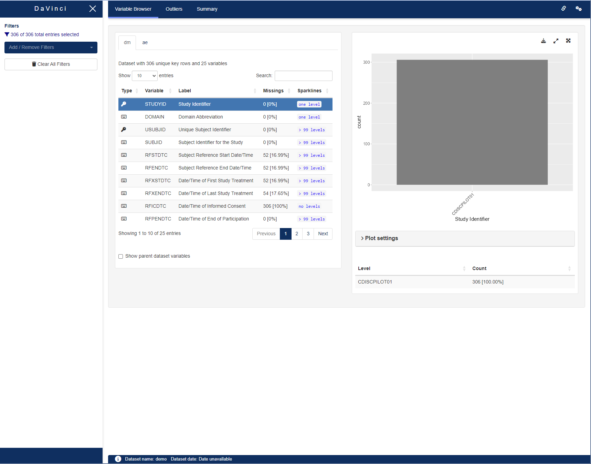

# DaVinci's Teal Wrapper Package {dv.teal}

## Description

The `{dv.teal}` package is designed to facilitate the integration of teal modules within the DaVinci framework. It provides a generic wrapper function, which enables the user to use teal modules within the Module Manager.

## Modifications

Since teal's reporter functionality cannot be supported by the DaVinci framework, it was removed by means of `htmltools::tagQuery()`.

## Installation

Feel free to copy the following code chunk to install the latest
version of {dv.teal}.

``` r
if (!require("remotes")) install.packages("remotes")
remotes::install_github("Boehringer-Ingelheim/dv.teal")
```


## Usage 


The generic wrapper function *dv.teal::mod_teal()* enables the user to use all teal modules with *{dv.manager}*.

Most commonly used teal modules can be found in the following packages: 

  -   [`teal.modules.general`](https://insightsengineering.github.io/teal.modules.general/latest-tag/): general modules for exploring relational/independent/CDISC data

  -   [`teal.modules.clinical`](https://insightsengineering.github.io/teal.modules.clinical/latest-tag/): modules specific to CDISC data and clinical trial reporting


Once you have decided on a teal module to use within DaVinci, follow the module's documentation to set it up as you would within teal.

You also need to define the join_keys for your datasets. [teal.data::join_keys()](https://insightsengineering.github.io/teal.data/latest-tag/reference/join_keys.html) is used to achieve this. 


```r

library(teal.modules.general)
library(dv.teal)

dm <- pharmaversesdtm::dm 

ae <- pharmaversesdtm::ae

data_list <- list(
  dm = dm,
  ae = ae
)

j_key <- teal.data::join_keys(
  teal.data::join_key(
    "dm",
    keys = c("STUDYID", "USUBJID")
  ),
  teal.data::join_key(
    "ae",
    keys = c("STUDYID", "USUBJID")
  ),
  teal.data::join_key(
    "dm",
    "ae",
    keys = c("STUDYID", "USUBJID")
  )
)

tm_var <- teal.modules.general::tm_variable_browser(
  datasets_selected = c("dm", "ae"),
  parent_dataname = "dm"
)

module_list <- list(
  "Variable browser" = mod_teal(
    module_id = "var_browser",
    teal_module = tm_var,
    j_keys = j_key
  )
)

dv.manager::run_app(
  data = list("demo" = data_list),
  module_list = module_list,
  filter_data = "dm"
)
```


